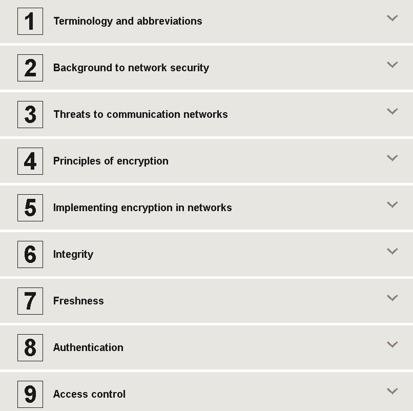
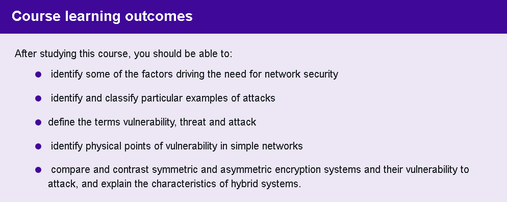

# 🌐 Network Security – OpenLearn (The Open University)

> 📚 This repository contains structured notes, demos, screenshots, and a certificate of completion for the **Network Security** course by [OpenLearn – The Open University](https://www.open.edu/openlearn).

---

## 🧠 Course Overview

This course introduces the principles of network security, including threats, defense mechanisms, protocols, and encryption techniques. It’s ideal for students in cybersecurity, IT, and ethical hacking.

---

## 📚 Structured Notes

All notes are written in Markdown and cover key concepts:

- 🛡️ [`intro-to-network-security.md`](./notes/intro-to-network-security.md) – Core principles, CIA triad  
- ⚠️ [`network-threats.md`](./notes/network-threats.md) – Malware, social engineering, DoS  
- 🔥 [`firewalls-and-acls.md`](./notes/firewalls-and-acls.md) – Packet filtering, ACL examples  
- 🔐 [`encryption-in-networks.md`](./notes/encryption-in-networks.md) – Symmetric, asymmetric, hashing  
- 🔗 [`secure-protocols.md`](./notes/secure-protocols.md) – Secure vs insecure protocols

---

## 🛠️ Demo Simulations

Hands-on demos simulating key network security concepts:

- 🔧 [`firewall-rules-example.md`](./demo/firewall-rules-example.md) – Create basic `iptables` firewall rules  
- 📡 [`packet-sniffing-simulation.md`](./demo/packet-sniffing-simulation.md) – Simulate traffic sniffing with `tcpdump`

---

## 🚨 Network Misconfigurations

Real-world misconfiguration examples and how to fix them:

- 🔓 [`open-ports.md`](./network-misconfiguration/open-ports.md)  
- 🔑 [`weak-default-credentials.md`](./network-misconfiguration/weak-default-credentials.md)  
- 🔥 [`firewall-misconfiguration.md`](./network-misconfiguration/firewall-misconfiguration.md)  
- 🧪 [`insecure-services.md`](./network-misconfiguration/insecure-services.md)  
- 📉 [`logging-disabled.md`](./network-misconfiguration/logging-disabled.md)  
- 📡 [`plaintext-transmission.md`](./network-misconfiguration/plaintext-transmission.md)

---

## 🖼️ Course Screenshots

| Topic              | Screenshot |
|--------------------|------------|
| 🧩 Course Content   |  |
| 🎯 Learning Goals   |  |
| ✅ Course Review    |    |

---

## 🎓 Certificate of Completion

- 🧠 [`openlearn-network-security-certificate.png`](./cert/openlearn-network-security-certificate.png)

---

## 📝 Personal Reflection

This OpenLearn course is a great foundation for anyone exploring network security. Despite being introductory, it covers essential concepts that are critical in real-world cybersecurity work.

### ✅ Highlights

- Accessible language and structured layout  
- Clear explanations of protocols, threats, and encryption  
- Good for security-minded beginners (Red Team or Blue Team)

### 📌 Suggestions for Improvement

- Include more interactive labs or packet capture exercises  
- Expand slightly on modern threats like phishing kits, botnets

---

## 💡 Ideal For

- Students in IT, cybersecurity, or CTF beginners  
- System administrators wanting a security refresh  
- Learners preparing for CompTIA Security+, CEH, or OSCP tracks

---

## ✍️ Author

**Thành Danh** – Security Researcher & Red Team Enthusiast  
GitHub: [@ngvtdanhh](https://github.com/ngvtdanhh)  
Email: ngvu.thdanh@gmail.com

---

## ⚖️ License

This repository is licensed under the **GNU AGPL v3.0**.  
See [`LICENSE`](./LICENSE) and [`DISCLAIMER.md`](./DISCLAIMER.md) for full details.

© 2025 ngvtdanhh. All rights reserved.
